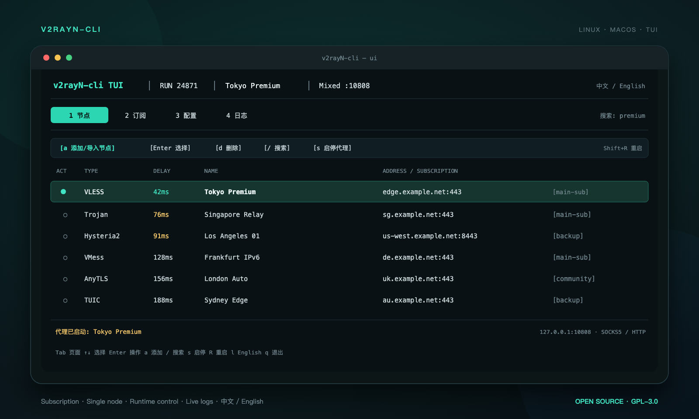

# v2rayN-cli

Linux/macOS 无图形界面的 v2rayN 命令行与全屏终端客户端，支持订阅链接、单节点、节点管理、配置编辑、实时日志和中英文 TUI。

[](https://github.com/Ryderwe/v2rayN-cli/actions/workflows/release-cli.yml)
[](https://github.com/Ryderwe/v2rayN-cli/actions/workflows/sync-upstream-release.yml)
[](https://github.com/Ryderwe/v2rayN-cli/releases)

## 界面预览

[](docs/v2rayn-cli-tui-preview.png)

## 安装 .NET 10 SDK

> 只有从源码构建 `v2rayN-cli` 时才需要安装 .NET 10 SDK。通过 Release 下载的自包含程序不需要安装 .NET。

macOS 和 Linux 都可以使用微软官方安装脚本：

```bash
curl -fsSL https://dot.net/v1/dotnet-install.sh -o /tmp/dotnet-install.sh
bash /tmp/dotnet-install.sh --channel 10.0 --install-dir "$HOME/.dotnet"
```

让当前终端立即生效：

```bash
export DOTNET_ROOT="$HOME/.dotnet"
export PATH="$DOTNET_ROOT:$PATH"
dotnet --version
```

如果使用 macOS 默认的 Zsh，将环境变量永久写入 `~/.zshrc`：

```bash
grep -q 'DOTNET_ROOT="$HOME/.dotnet"' "$HOME/.zshrc" 2>/dev/null || cat >> "$HOME/.zshrc" <<'EOF'

export DOTNET_ROOT="$HOME/.dotnet"
export PATH="$DOTNET_ROOT:$PATH"
EOF

source "$HOME/.zshrc"
```

如果 Linux 使用 Bash，将同样的配置写入 `~/.bashrc`：

```bash
grep -q 'DOTNET_ROOT="$HOME/.dotnet"' "$HOME/.bashrc" 2>/dev/null || cat >> "$HOME/.bashrc" <<'EOF'

export DOTNET_ROOT="$HOME/.dotnet"
export PATH="$DOTNET_ROOT:$PATH"
EOF

source "$HOME/.bashrc"
```

安装成功后，`dotnet --version` 应显示 `10.x`。

## 从源码构建

```bash
git clone https://github.com/Ryderwe/v2rayN-cli.git
cd v2rayN-cli

./package-cli.sh osx-arm64   # Apple Silicon macOS
./package-cli.sh linux-x64   # x86_64 Linux

# Apple Silicon 构建完成后启动
./release-cli/v2rayN-cli-*-osx-arm64/v2rayN-cli ui
```

## GitHub Actions 自动发布

推送符合 `v*-cli.*` 格式的标签后，Actions 会自动构建 Linux/macOS 的 x64、ARM64 四个安装包，生成 `SHA256SUMS` 并创建 GitHub Release：

```bash
git tag -a v7.23.4-cli.1 -m "v2rayN-cli v7.23.4-cli.1"
git push origin v7.23.4-cli.1
```

也可以进入仓库的 **Actions → Release v2rayN-cli → Run workflow**，输入版本标签手动发布。

仓库还提供 **Sync upstream and release** 工作流，每 6 小时检查一次
[2dust/v2rayN](https://github.com/2dust/v2rayN) 的 `master` 分支。发现新提交后会自动合并到本仓库的
`master`，构建四个平台安装包并创建 Release。也可以在 Actions 页面手动运行；启用
`force_release` 后，即使上游没有新提交也会重新构建一个 Release。

完整的构建、安装和快捷键说明见 [v2rayN-cli 文档](v2rayN/v2rayN.Cli/README.md)。

本项目基于 [2dust/v2rayN](https://github.com/2dust/v2rayN) 开发并继续遵循 GPL-3.0 许可证。下方保留上游项目说明。

## Upstream v2rayN

### A GUI client for Windows, Linux and macOS. Support [Xray](https://github.com/XTLS/Xray-core) and [sing-box](https://github.com/SagerNet/sing-box) and [others](https://github.com/2dust/v2rayN/wiki/List-of-supported-cores)

[](https://www.codefactor.io/repository/github/2dust/v2rayn)
[](https://github.com/2dust/v2rayN/releases)
[](https://github.com/2dust/v2rayN/releases)
[](https://t.me/v2rayn)
 
[](https://github.com/2dust/v2rayN) 
[](https://github.com/2dust/v2rayN) 
[](https://github.com/2dust/v2rayN) 
[](https://github.com/2dust/v2rayN)


---

## Download / 下载

Download the latest release here:

在这里下载最新版本：

[https://github.com/2dust/v2rayN/releases](https://github.com/2dust/v2rayN/releases)


> [!TIP]
> v2rayN is the desktop version. For the mobile version, please visit the v2rayNG \
> v2rayN 是电脑版，手机版请访问 v2rayNG
>
> https://github.com/2dust/v2rayNG

---

## Documentation / 使用文档

Read the Wiki for usage guides and configuration details.

请阅读 Wiki 获取使用说明和配置教程。

[https://github.com/2dust/v2rayN/wiki](https://github.com/2dust/v2rayN/wiki)

---

## Supported Platforms / 支持平台

| Platform / 平台 | x64 | x86 | arm64 | riscv64 | loong64 |
| --- | --- | --- | --- | --- | --- |
| Windows | ✅ | ✅ | ✅ | - | - |
| Linux | ✅ | - | ✅ | ✅ | ✅ |
| macOS | ✅ | - | ✅ | - | - |

---

## GPG Verification / GPG 签名校验

Release files are signed with GPG to verify authenticity and integrity, helping prevent mirror, ISP, or CDN hijacking.

发布文件已使用 GPG 签名，可用于校验文件真实性与完整性，预防镜像站、运营商或 CDN 劫持。

### Fingerprint / 公钥指纹

```text
7694 5E9F 3E9A 168F 8070 F195 805D 661C
134D FAF6 8903 C199 463C 31E5 AE90 3AE0
```

---

## Community / 社区

Telegram Group / Telegram 群组：

[https://t.me/v2rayN](https://t.me/v2rayN)

Telegram Channel / Telegram 频道：

[https://t.me/github_2dust](https://t.me/github_2dust)
